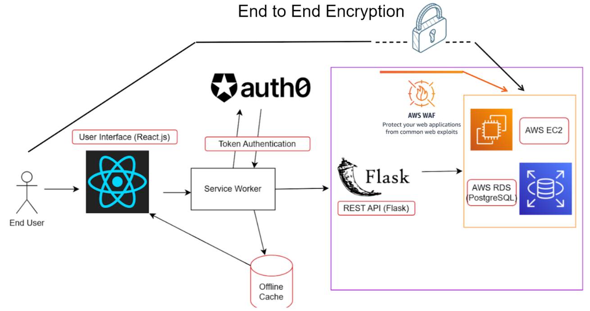
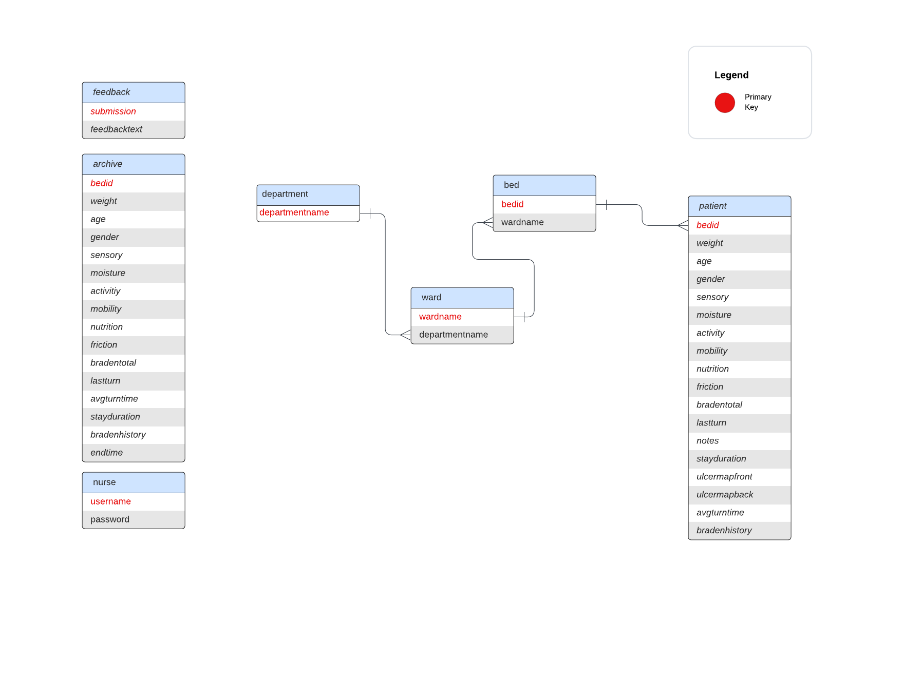

# Overall Architecture and Flow of Data

Our app's overall architecture can best be summarized by this diagram:



Certain parts are explained below later in this section, while others (like AWS) have their own section. At a high level, the flow of data throughout the app can best be described as follows:

- When a user interacts with the UX, they are interacting front end build using JavaScript and React.
    - The entire app, from the front end, to the back end and database, is hosted on AWS. The front and back end are bundled up into a Docker image that is run on an AWS service called ElasticBeanstalk.
- If necessary, the JavaScript then makes an API call using the `fetch` function to our REST API written in Python and Flask.
- Before the API call even hits the desired endpoint, a series of intermediary steps occur.
    - First, the API call is intercepted by a service worker. If the service worker already has a token cached, it hands the call to the API endpoint.
    - If a token is not cached, a call to a third party API is made to acquire a valid token from an authentication and authorization service called Auth0. With the token, the service worker now proceeds to the API endpoint.
    - If the network is offline, the service worker returns a default offline page to render with cached data.
- When the API call hits the appropriate endpoint, it reaches the corresponding Flask route decorator (specified with the @ symbol). Within the API endpoint function that is executed, a database query is run.
    - In order to execute a query on a database hosted in the cloud on AWS, a Python library called boto3 is used to make a connection to the database.


# Database Schema

A [database schema](https://www.ibm.com/topics/database-schema#:~:text=the%20next%20step-,What%20is%20a%20database%20schema%3F,the%20relationships%20between%20these%20entities.) defines data organization within a relational database. In this section, we describe the Alivio Database Schema. 



For any column that has a timestamp data type, those timestamps are stored in the UTC timezone. When times are actually rendered on the front end, libraries that we use such as moment.js convert from UTC to local time.

In the patient table, here are some specific columns that we would like to callout in order to explain how they store data.

- **Stay Duration**

    - Stores a timestamp of when the patient card was added. In the fornt end, this timestamp is subtracted from the current time to produce the stay duration in days as an integer.

- **Ulcer Map Front and back and Back** 
    - Stores a big string of pairs delimited by the | character. The pairs are delimited by commas, so the entire string looks something like this: `<x1>,<y1>|<x2>,<y2>|`.
    - Each pair holds the values `<x>,<y>`, where x represents the x coordinate of the ulcer dot on the image and y represents the corresponding y coordinate.

- **Average Turn Time** 

    - Stores a varchar(500). 
    - Stores the total time a patient has been in the ICU and the number of turns seperated by a comma 
        - Following the format `<total-time>,<turns>`
        - eg: `1005,6`
        - When this data is called, the string can be parsed and the average turn time can be calculated by doing `total-time / turns`

- **Braden History**
    - Stores a big string of pairs delimited by semicolons. The pairs are delimited by commas. 
    - The string follows this format: `<timestamp>,<braden-value>;<timestamp-2>,<braden-value-2>; ... ;<timestamp-n>,<braden-value-n>;`
    

# Service Workers

- We use a [service worker API](https://developer.mozilla.org/en-US/docs/Web/API/Service_Worker_API) in our application. A service worker is a proxy server that sits between our web app, the browser and the network (when it is available). 
- The purpose of the service worker is to create an offline user experience for our application. 
    - Because our app is meant to be used in an ICU, we must try and maintain 100% uptime for our application. A service worker helps us achieve this goal. 

- The code for the service worker can be found in the file: `/serviceWorker.js`. As of the time of writing, it is in the `archive_token` branch and hasn't been merged into main. 

## How the service worker functions

- The service worker runs in a different thread than the main application, and caches application data. When internet connection is disrupted cached assets can be used to maintain functionality of our application. 
    - Cached assets can be used for offline functionality but also to speed up the app performance in general. 
    - The service worker will intercept API calls that the app makes and in the event that it has cached the assets that are being requested, it will stop the call early and provide the response instead. 
- The service worker uses two types of caches. A **static** and a **dynamic** cache.
    - We use the **dynamic** cache to store data that changes such as patient data (patient cards). 
    - We use the **static** cache to store app assets 


# Token Authentication

[Token-based authentication](https://www.okta.com/identity-101/what-is-token-based-authentication/) is a protocol which allows users to verify their identity, and in return receive a unique access token. During the lifetime of the token, users can then access different parts of our app. Please read the link about token authetication before proceeding.

- Project Alivio uses token authentication. To autheticate into the app, a user will type in a username and password that will be verified based on info stored in the database. If the verfication proceeds, the login API endpoint will make a request for a token to an Auth0 API (see the `get_token` function in `middleware/token_auth.py`) and the service worker will cache it. 
    - This token allows users to interact with our API endpoints and therefore our database. 
    - The purpose of token authentication is to create a secure system for users to access sensitive patient data. 
    - Once a user logs in, the user has a 24 hr token that will allow them to use the app fully. After 24 hours or a logout, the token expires. 
- Code for token authentication can be found in `api/login.py` and `middlerware/token_auth.py`. 


# File Structure

Here is the output of the command: `$ tree -I "env"` with explanation. 

```cpp
.
├── api                     // back-end
│   ├── __init__.py
│   ├── braden.py
│   ├── clock.py
│   ├── index.py
│   └── stats.py
├── application.py
├── bin                 
│   └── alivio
├── client                  // front-end
│   ├── addPatient.jsx
│   ├── bradenInputs.jsx
│   ├── calculator.jsx
│   ├── clock.jsx
│   ├── feedbackForm.jsx
│   ├── helpers.js
│   ├── home.jsx
│   ├── main.jsx
│   ├── patientCard.jsx
│   ├── patientStats.jsx
│   ├── stats.jsx
│   ├── styles
│   │   ├── calculator.css
│   │   ├── card.css
│   │   ├── clock.css
│   │   ├── home.css
│   │   └── stats.css
│   └── ulcerMap.jsx
├── config.py
├── model.py
├── package-lock.json
├── package.json
├── requirements.txt
├── setup.py
├── sql
│   └── schema.sql
├── static                 // store static assets such as images
│   ├── assets
│   │   ├── ulcer_map_back.png
│   │   └── ulcer_map_front.png
│   ├── images
│   │   ├── ulcer_map_back.png
│   │   └── ulcer_map_front.png
│   └── js
│       └── bundle.js.map
├── templates
│   └── index.html
└── webpack.config.js

10 directories, 38 files
```
